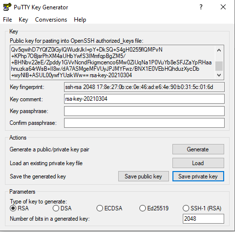
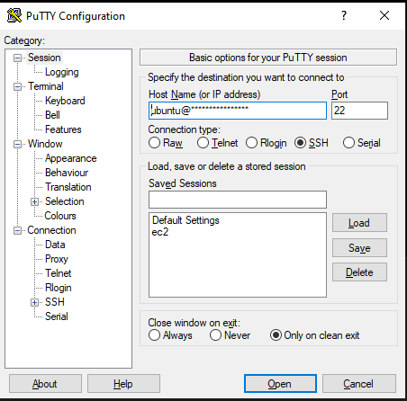
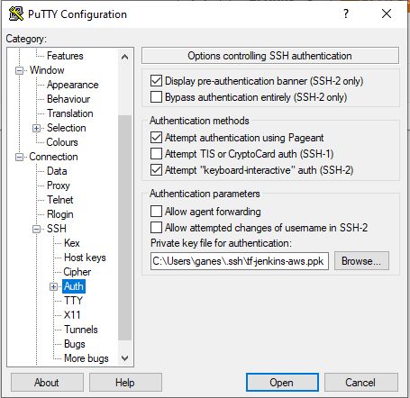

#  EC2 with Terraform
Deploy EC2 instance with ssh access
- [EC2 with Terraform](#ec2-with-terraform)
  - [Required elements](#required-elements)
  - [Folder structure](#folder-structure)
  - [Deployment](#deployment)
  - [SSH to EC2 instance](#ssh-to-ec2-instance)
  - [Destroy](#destroy)

## Required elements
- Download puttygen.exe from <https://www.chiark.greenend.org.uk/~sgtatham/putty/latest.html>
- Open puttygen.exe
- Click on "Generate" button and wait for a few moments
  []
- Copy and make a note of Public key
- Click on button "Save private key" and give a name (in this example: tf-jenkins-aws)
- Remember to use the same keypair name everywhere.

##  Folder structure
```bash
├── 08_tf_ec2_ssh
|   ├── variables.tf
|   ├── env.test.tfvars
|   ├── provider.tf
|   ├── ec2.tf
|   ├── networking.tf
|   ├── assets/
|   └── README.md
```

## Deployment
Once you have the repository. Initialize the terraform to get required modules and then run terraform plan to see what all resources terraform will create.

```sh
cd 05_tf_modules/dev
terraform init
terraform plan      
terraform apply
```

## SSH to EC2 instance
-  Copy "public ip" from the output of terraform apply
-  Open putty.exe
-  Enter ubuntu@<public_ip>
    []
-  Click on Category -> Connection -> SSH -> Auth
-  Select Private key file for authentication
   []
- Click on "Open" button
- It should log you in and opens up command prompt
  
## Destroy 
Do not forget to desctroy deployed stacks when not using.
```sh
terraform destroy
```

